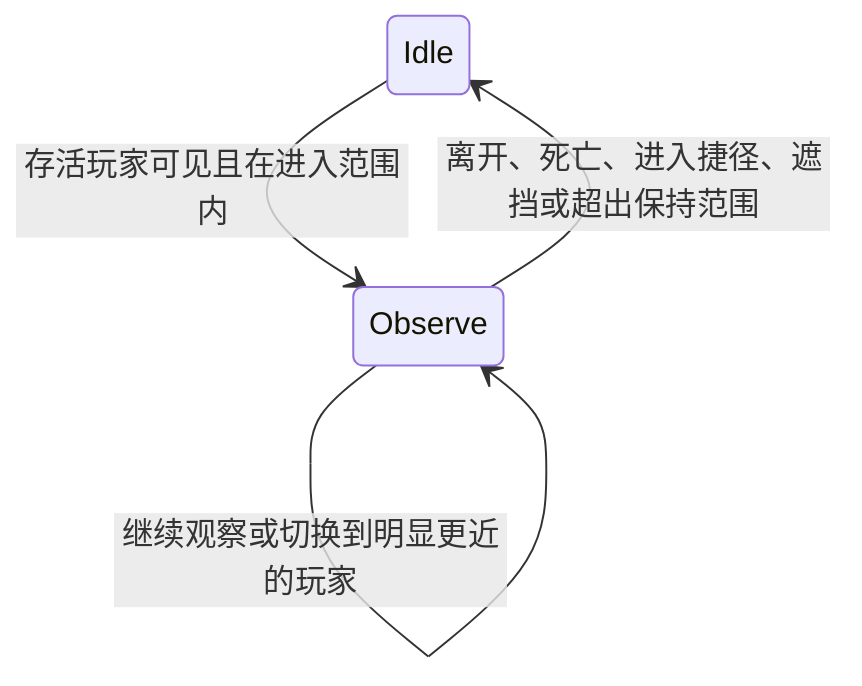

# Brain、动作、行为模块与玩家感知

第五阶段提供 IteratorBrain、IteratorAction、IteratorStateMachine、IteratorBehaviorModule、PlayerSensor、基础 Idle 和玩家观察。公共命名空间为 `DryCycle.Iterators`。行为通过 Body 的 MoveTo、LookAt、SetPose 等接口表达意图，不直接修改 Sprite，也不实现对话、武器反应、物品交互或存档。

## 默认行为与替换

最小注册默认创建 StandardIteratorBrain：无可观察玩家时使用 Idle，保留 Body 的悬停、移动目标和姿势；有可见存活玩家时注视玩家。不会追逐、攻击、驱逐或自动开始对话。

```csharp
var definition = Iterator.Create("MYMOD_OBSERVER")
    .Room("MYMOD_AI")
    .Brain(ctx => new StandardIteratorBrain(ctx,
        new IteratorSensorProfile(sampleInterval: 5, observeRange: 450, retainRange: 500)))
    .Register();
```

只需要自定义 Runtime 控制时可用 `.Brain(ctx => new IteratorBrain(ctx))`：它提供感知和被动 Idle，不安装观察模块。每次生成必须创建新的 Brain；模块和 Action 也不能跨实例复用。IteratorSensorProfile 可以共享。

Builder 新增 `.Brain(factory)`，Descriptor 新增只读 BrainFactory 和九参数完整构造重载，原有四、五、七、八参数构造签名继续可用。Context.Brain 与 Runtime.Brain 返回同一实例。

## 自定义动作

```csharp
public sealed class MyBrain : IteratorBrain
{
    public MyBrain(IteratorContext context) : base(context) { }

    protected override void OnInitialize()
    {
        RegisterAction(new ThinkAction());
        SetAction("Think");
    }
}

public sealed class ThinkAction : IteratorAction
{
    private IteratorPose _previousPose;
    public ThinkAction() : base("Think", priority: 20, interruptible: false) { }
    protected override bool CanEnter() => Context.Body.IsInitialized;
    protected override void OnEnter()
    {
        _previousPose = Context.Body.Pose;
        Context.Body.SetPose(IteratorPose.Think);
    }
    protected override void OnUpdate()
    {
        if (ElapsedFrames >= 79) Complete();
    }
    protected override void OnExit(IteratorActionExitReason reason)
    {
        if (!Context.Body.IsDestroyed && Context.Body.Pose == IteratorPose.Think)
            Context.Body.SetPose(_previousPose);
        _previousPose = null;
    }
}
```

在 `.Brain(ctx => new MyBrain(ctx))` 中使用。Action 支持 OnInitialize、CanEnter、CanContinue、OnEnter、OnUpdate、OnExit 和 OnDestroy。CanEnter 决定是否可以进入，CanContinue 决定当前动作能否继续；需要持续成立的条件应在后者中检查。ElapsedFrames 从每次进入时的 0 开始，完成一次动作更新后增加。

动作由 Brain.OnInitialize 或模块 OnInitialize 注册，初始化后布局冻结。内置 `Idle` 为保留的最低优先级回退名称。StateMachine.Actions 是只读视图，可用 TryGet 查询；CurrentAction、IsActive、IsCompleted、IsEnabled、IsDestroyed、ElapsedFrames 和 TransitionCount 用于检查当前状态。

## 仲裁与切换约定

`Brain.SetAction(action)` 或 `Brain.SetAction("Name")` 排队提出请求。true 表示请求有效（或已经是当前动作），不保证马上切换；未知名称、外来动作及 null 是参数错误，已停用或销毁的动作/Brain 不接受新请求。

- 只执行已请求且 CanEnter 成立的动作；多个候选选择最高 Priority，同优先级按注册顺序选择。
- 当前动作有效且可打断时，较低优先级请求不能打断它；相同优先级的显式请求可以切换。
- 不可打断的动作继续执行，其他请求保留到其完成或 CanContinue 失效后重新检查条件。不可打断不阻止销毁、故障退出或条件失效。
- 每帧最多进入一个新动作，Enter / Update / Exit / 条件回调中的新请求留给下一帧。再次请求正在执行的动作不重置计时。
- Complete 标记本次执行完成；下一帧退出并选择待处理动作或 Idle。完成后可显式再次请求该动作。
- 没有可用候选时回到 Idle。退出原因包括 Replaced、Completed、ConditionLost、Failed、BrainDisabled、Destroyed。

默认观察行为：



## 组合 BehaviorModule

```csharp
public sealed class LogArrivals : IteratorBehaviorModule
{
    public LogArrivals() : base("LogArrivals") { }
    protected override void OnPlayerEvent(IteratorPlayerEvent change)
    {
        if (change.Kind == IteratorPlayerEventKind.Entered)
            Context.Logger.Info("玩家进入当前房间");
    }
}

// 放在注册链中；也可以在派生 Brain 的 OnInitialize 内 Use。
// .Brain(ctx => new StandardIteratorBrain(ctx).Use<LogArrivals>())
```

Use 接受模块实例或带 public 无参构造的模块类型。模块名称必须唯一，初始化后不能追加；最多 64 个模块、128 个动作（含 Idle）。模块可以注册自己的动作并用 SetAction 提出请求。

OnPlayerEvent 接收集中的变化通知；OnSense 只在新采样完成后执行，适合决策；OnUpdate 每帧执行，适合计时等必要逻辑。构造函数不要申请需要框架回收的资源，将初始化和清理放入 OnInitialize / OnDestroy。回调中的 Context.Logger 自动携带 Brain、Action.名称或 Behavior.名称及对应阶段。

## Sensors 与事件

`Brain.Sensors` 返回 PlayerSensor。它复用 Context.Players 的当前房间玩家视图，集中计算位置、距离、可见性和接近状态，不扫描所有游戏对象，不让每个行为模块重复做距离与视线检查。

| API / 配置 | 说明 |
| --- | --- |
| Sensors.Players / TryGet(player, out observation) | 只读实时记录列表，或按实际 Player 身份查询。 |
| PlayerObservation | Player、IsPresent、IsAlive、InShortcut、HasPosition、Position、Distance、IsVisible、IsNear。 |
| NearestVisiblePlayer | 进入范围内最近的可观察玩家；无候选时为 null。 |
| CanObserve(observation, retaining) | 检查归属、有效位置、生命/捷径状态、可见性及进入或保持距离。 |
| SampleCount / RequestRefresh() | 已完成采样数；请求下次 Brain 更新提前采样，不同步重入。 |
| SampleInterval | 默认 5 帧，范围 1–600；首个 Brain 更新立即采样。 |
| ObserveRange / RetainRange | 默认 600 / 650 像素，允许当前目标稍微越过进入边界后仍被观察。 |
| NearRange / NearExitRange | 默认 120 / 150 像素，接近事件采用不同进入/退出阈值，避免边缘反复触发。 |
| TargetSwitchMargin | 默认 40 像素，其他玩家明显更近时才切换；平距保留目标。 |
| RequireVisibility | 默认 true，复用实际 Room.VisualContact 做地形视线检查；false 仅按距离和玩家状态筛选。 |

没有有效 BodyChunk 坐标的玩家仍可产生进出记录，但不会成为观察目标。死亡、在捷径中或失效的玩家不被观察；距离和视线结果在两次采样之间缓存。默认观察动作只写入注视目标，保留已有姿势与移动输入。

通知包括 Entered、Left、Approached、MovedAway、Died、Revived，由传感器比较相邻采样集中发出，模块不重复检测。首次发现已死亡玩家不会补发 Died；完全在两次采样之间发生的短暂变化可能不被观察到。这是感知通知，不是物品、伤害或游戏原始事件 Hook。

Left 回调中 Player 仍可用但 IsPresent 已为 false，全部通知结束后记录清空 Player；Brain 停用/销毁时也清空所有记录。不要持久保存事件参数或复制出来的 Player 引用。IsVisible 是地形视线结果，不包含屏幕可见性、光照、伪装或完整潜行 AI。

## Runtime 顺序与隔离

创建：Body / Arm → Graphics → 刷新 Context 玩家 → Brain / 模块 / 动作初始化与 Idle → Runtime.OnCreate 及其余初始化回调。首次感知在第一个游戏更新执行，不在注册或构造阶段执行。

每帧：刷新 Context 玩家 → Brain 感知/通知/OnSense → Brain 与模块 OnUpdate → StateMachine / Action → Runtime.OnUpdate → Body / Arm 控制与游戏物理 → Graphics → Runtime.OnLateUpdate。Runtime.OnUpdate 因此可以在同帧覆盖 Brain 的身体输入。

销毁：Runtime.OnDestroy → 当前 Action.Exit → 动作逆序销毁 → 模块逆序销毁 → Brain.OnDestroy / 感知清理 → Graphics → Arm → Body → 宿主和 Context 清理。销毁和回调重入受保护，不继续执行已经销毁实例的后续回调。

行为模块失败只停用本模块及其注册的动作，其他模块继续。动作条件或回调失败停用该动作；若它正在运行，立即执行一次失败退出，下一帧可回到 Idle。Brain 工厂或整体初始化失败时清理已接管组件，使用被动 IteratorBrain 回退；整体 Brain 更新失败停用行为，保留 Runtime、Body 与 Graphics。停用的模块/动作仍在实例最终销毁时执行 OnDestroy。

自定义动作应在 OnExit 清理自己设置的持续身体输入；框架不能自动判断一个 MoveTo / Pose 是否属于其他控制器。内置 Observe 只清除仍与自己最后一次写入相同的注视目标。清理回调必须能处理部分初始化。

## PWN_AI 与验证

PwnIteratorExample 已显式接入 StandardIteratorBrain，保留白紫长袍、金色头饰、展示姿势与悬停位置。进入房间的可见玩家会成为观察对象；离开、死亡、进入捷径或被墙挡住后结束观察。没有新增对话、态度值、剧情或游戏世界文件修改。

第五阶段新增五组必要检查：动作仲裁/完成/不可打断/回调请求，实际 Room.VisualContact 与玩家状态、事件和阈值，动作/模块/Brain 故障隔离，工厂/归属/销毁清理，以及 PWN 的 Brain → Body → 面部网格传递。构建命令与结果见 [PROGRESS.md](PROGRESS.md)。仍使用真实游戏程序集的托管夹具，没有进行 Unity 游戏内多玩家游玩或原生音画验收。
